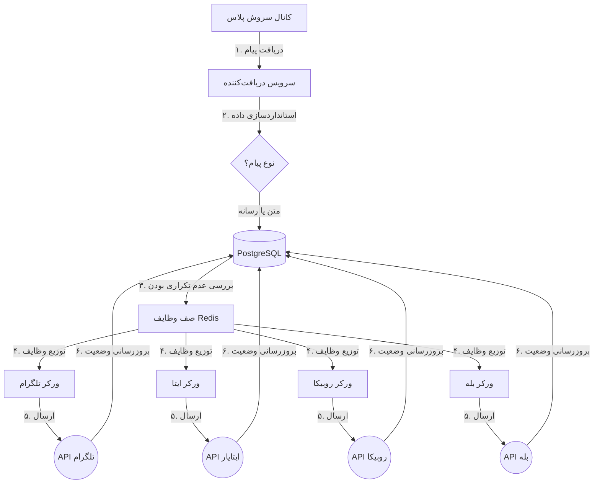

# 🤖 ربات سینک‌کننده پیام (Robot Sender)

[**English**](./README.md) | [**فارسی**](./README.fa.md)

---

## 🏗️ چرخه کاری سیستم (نمای گرافیکی)



---

## 🚀 معرفی پروژه
این پروژه یک ربات حرفه‌ای برای همگام‌سازی محتوا از کانال‌های **سروش پلاس** به **تلگرام، ایتا، روبیکا و بله** است. طراحی سیستم به صورت توزیع‌شده (Distributed) انجام شده تا حتی در صورت قطع بودن یکی از پیام‌رسان‌ها، سایرین به درستی به کار خود ادامه دهند.

## ✨ ویژگی‌های برجسته
- **🔄 همگام‌سازی چند پلتفرمی:** پشتیبانی از متن، عکس، ویدیو و فایل.
- **🛡️ ورکرها (Workers) مجزا:** هر پلتفرم توسط یک پردازش مستقل مدیریت می‌شود.
- **🔄 تلاش مجدد هوشمند:** بازه زمانی تلاش مجدد به صورت توان‌دار (۱، ۲، ۴ دقیقه و...) افزایش می‌یابد.
- **🚫 ضد تکرار:** دیتابیس PostgreSQL تضمین می‌کند که هیچ پیامی دو بار ارسال نشود.
- **🐳 استقرار با یک کلیک:** کاملاً داکریزه شده با استفاده از Docker Compose.

---

## 🚀 راه اندازی سریع

۱. **تنظیمات:**
   ```bash
   cp .env.example .env
   # فایل .env را با توکن‌های خود ویرایش کنید
   ```

۲. **استقرار:**
   ```bash
   docker-compose up -d --build
   ```

۳. **مانیتورینگ:**
   - سلامت سیستم: `http://localhost:8000/health`
   - لاگ‌های زنده: `docker-compose logs -f worker`

---

## 📝 نکات پیام‌رسان‌های ایرانی
- **ایتا:** توکن را از [ایتایار](https://eitaayar.ir) بگیرید و `@sender` را ادمین کنید.
- **سروش:** از بازوی `@mrbot` برای گرفتن توکن استفاده کنید.
- **بله و روبیکا:** از بازوی `@BotFather` در داخل اپلیکیشن استفاده کنید.

---

## 📜 لایسنس
MIT License.
