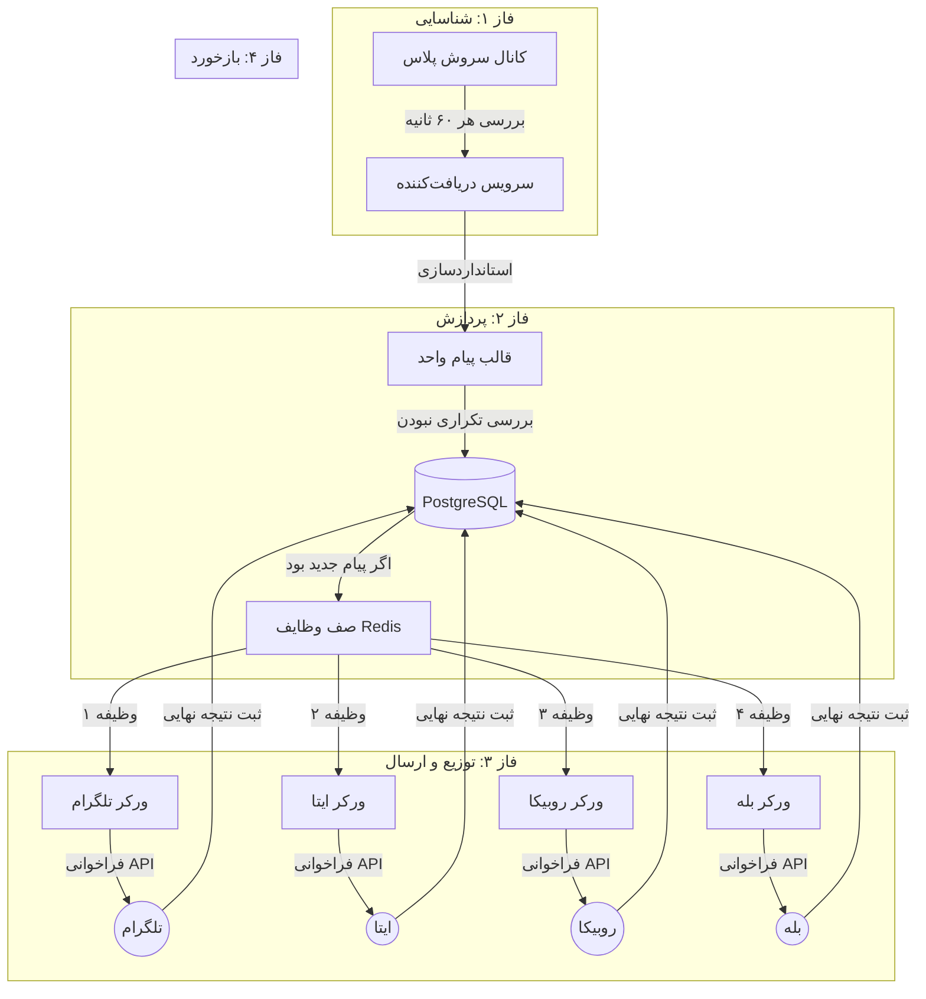

# 🤖 ربات سینک‌کننده پیام (Robot Sender)

[**English**](./README.md) | [**فارسی**](./README.fa.md)

---

## 🏗️ معماری سیستم و چرخه کاری

### ۱. نمای گرافیکی (Flowchart)


---

### ۲. نحوه کارکرد (گام‌به‌گام)

۱.  **پایش (Detection):** هر یک دقیقه، ربات از API سروش می‌پرسد: "آیا پست جدیدی منتشر شده است؟".
۲.  **یکسان‌سازی (Normalization):** وقتی پست جدیدی پیدا می‌شود (مثلاً یک ویدیو با متن)، سیستم آن را به یک **قالب استاندارد** تبدیل می‌کند. دیگر فرقی نمی‌کند پیام از کجا آمده؛ حالا فقط یک "وظیفه ارسال ویدیو" است.
۳.  **جلوگیری از تکرار (Deduplication):** سیستم دیتابیس **PostgreSQL** را چک می‌کند. اگر این پیام قبلاً سینک شده باشد، همین‌جا متوقف می‌شود تا از ارسال تکراری در کانال‌های شما جلوگیری شود.
۴.  **صف‌بندی (Queuing):** اگر پیام جدید باشد، سیستم ۴ دستور مجزا برای ۴ پیام‌رسان می‌سازد و آن‌ها را در **Redis** قرار می‌دهد.
۵.  **اجرای موازی (Parallel Execution):** ورکرها به صورت **همزمان** شروع به کار می‌کنند:
    - اگر تلگرام کند باشد، ایتا منتظر نمی‌ماند و فوراً کارش را انجام می‌دهد.
    - اگر ایتا قطع باشد، ورکر مخصوص آن هر چند دقیقه دوباره تلاش می‌کند، بدون اینکه خللی در کار تلگرام یا بله ایجاد شود.
۶.  **گزارش‌دهی:** بعد از ارسال موفق (یا شکست قطعی)، نتیجه در دیتابیس ثبت می‌شود تا شما بتوانید از طریق پنل `/logs` وضعیت هر پیام را پیگیری کنید.

---

## ✨ ویژگی‌های برجسته
- **🔄 همگام‌سازی چند پلتفرمی:** پشتیبانی از متن، عکس، ویدیو و فایل.
- **🛡️ ورکرها (Workers) مجزا:** هر پلتفرم توسط یک پردازش مستقل مدیریت می‌شود.
- **🔄 تلاش مجدد هوشمند:** بازه زمانی تلاش مجدد به صورت توان‌دار (۱، ۲، ۴ دقیقه و...) افزایش می‌یابد.
- **🚫 ضد تکرار:** دیتابیس PostgreSQL تضمین می‌کند که هیچ پیامی دو بار ارسال نشود.
- **🐳 استقرار با یک کلیک:** کاملاً داکریزه شده با استفاده از Docker Compose.

---

## 🚀 راه اندازی سریع

۱. **تنظیمات:**
   ```bash
   cp .env.example .env
   # فایل .env را با توکن‌های خود ویرایش کنید
   ```

۲. **استقرار:**
   ```bash
   docker-compose up -d --build
   ```

۳. **مانیتورینگ:**
   - سلامت سیستم: `http://localhost:8000/health`
   - لاگ‌های زنده: `docker-compose logs -f worker`

---

## 📝 نکات پیام‌رسان‌های ایرانی
- **ایتا:** توکن را از [ایتایار](https://eitaayar.ir) بگیرید و `@sender` را ادمین کنید.
- **سروش:** از بازوی `@mrbot` برای گرفتن توکن استفاده کنید.
- **بله و روبیکا:** از بازوی `@BotFather` در داخل اپلیکیشن استفاده کنید.

---

## 📜 لایسنس
MIT License.
