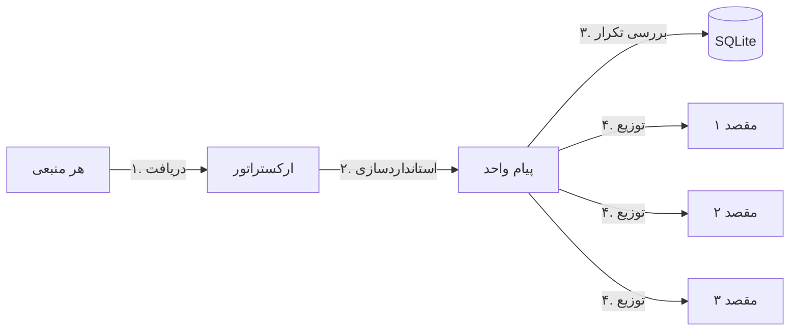

# 🤖 ربات ارسال‌کننده جهانی (Universal Robot Sender)

[**English**](./README.md) | [**فارسی**](./README.fa.md)

---

## 🏗️ چرخه کاری سیستم



---

## 🚀 معرفی پروژه
این ربات یک ابزار انعطاف‌پذیر بر پایه پایتون برای همگام‌سازی پیام‌ها است. برخلاف ربات‌های معمولی، این سیستم به شما اجازه می‌دهد **هر پلتفرم** پشتیبانی شده را به عنوان منبع انتخاب کنید و محتوای آن را **به صورت همزمان** به هر تعداد مقصد که می‌خواهید ارسال کنید.

## ✨ ویژگی‌های کلیدی
- **🔄 منبع/مقصد دلخواه:** سروش ↔ تلگرام ↔ بله ↔ روبیکا ↔ ایتا.
- **⚡ سرعت بالا:** استفاده از `asyncio` برای ارسال همزمان و سریع پیام‌ها.
- **📦 دیتابیس داخلی:** استفاده از SQLite برای ردیابی پیام‌ها و جلوگیری از ارسال تکراری بدون نیاز به تنظیمات پیچیده.
- **🛠️ تنظیمات آسان:** تمام تنظیمات در یک فایل `config.json` مدیریت می‌شود.
- **🐳 آماده برای داکر:** استقرار بسیار ساده با استفاده از Docker.

---

## 🚀 راه اندازی سریع

۱. **تنظیمات:**
   فایل `config.json` را برای تعریف منبع، مقصدها و توکن‌ها ویرایش کنید.
   ```json
   {
     "source": "soroush",
     "source_channel_id": "...",
     "targets": {
       "telegram": "@my_channel",
       "bale": "..."
     },
     "credentials": { ... }
   }
   ```

۲. **استقرار:**
   ```bash
   docker-compose up -d --build
   ```

---

## 📝 نکات پیام‌رسان‌های ایرانی
- **ایتا:** استفاده از توکن‌های [ایتایار](https://eitaayar.ir).
- **سروش:** استفاده از توکن‌های بازوی `@mrbot`.
- **بله و روبیکا:** استفاده از توکن‌های بازوی `@BotFather`.

---

## 📜 لایسنس
MIT License.
