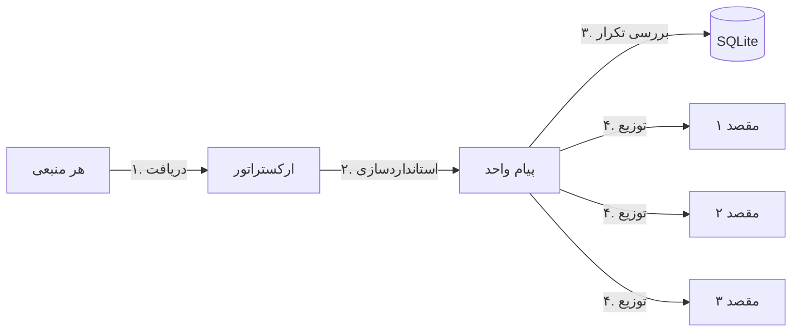

# 🤖 ربات ارسال‌کننده جهانی (Universal Robot Sender)

[**English**](./README.md) | [**فارسی**](./README.fa.md)

---

## 🏗️ چرخه کاری سیستم

---

## 🚀 معرفی پروژه
این ربات یک ابزار انعطاف‌پذیر بر پایه پایتون برای همگام‌سازی پیام‌ها است. برخلاف ربات‌های معمولی، این سیستم به شما اجازه می‌دهد **هر پلتفرم** پشتیبانی شده را به عنوان منبع انتخاب کنید و محتوای آن را **به صورت همزمان** به هر تعداد مقصد که می‌خواهید ارسال کنید.

## ✨ ویژگی‌های کلیدی
- **🔄 منبع/مقصد دلخواه:** سروش ↔ تلگرام ↔ بله ↔ روبیکا ↔ ایتا.
- **⚡ سرعت بالا:** استفاده از `asyncio` برای ارسال همزمان و سریع پیام‌ها.
- **📦 دیتابیس داخلی:** استفاده از SQLite برای ردیابی پیام‌ها بدون نیاز به تنظیمات.
- **🛠️ راه‌اندازی تمام خودکار:** بدون نیاز به ویرایش دستی کدها یا فایل‌های JSON.
- **🐳 آماده برای داکر:** استقرار بسیار ساده با استفاده از Docker.

---

## 🚀 راه‌اندازی سریع (جادوگر مرحله‌به‌مرحله)

### 🔹 ویندوز (Windows)
۱. روی فایل **`setup.ps1`** راست‌کلیک کرده و گزینه **"Run with PowerShell"** را انتخاب کنید.
۲. طبق جادوگر مرحله‌به‌مرحله پیش بروید (شامل انتخاب عددی پلتفرم‌ها و مثال برای فرمت IDها).
۳. در انتها گزینه `y` را بزنید تا برنامه به صورت خودکار با داکر اجرا شود.

### 🔹 لینوکس و مک (Linux / macOS)
۱. ترمینال را در پوشه پروژه باز کنید.
۲. اجازه اجرا به اسکریپت بدهید: `chmod +x setup.sh`
۳. اسکریپت را اجرا کنید: `./setup.sh`
۴. مراحل تعاملی را دنبال کرده و در انتها برای اجرا با داکر گزینه `y` را بزنید.

### 🔹 روش دستی (داکر)
۱. فایل `config.json` را با اطلاعات خود ویرایش کنید.
۲. دستور مقابل را اجرا کنید: `docker-compose up -d --build`

---

## 🛠️ عیب‌یابی (Troubleshooting)

| مشکل | علت احتمالی | راه حل |
| :--- | :--- | :--- |
| **خطای اجرای `setup.ps1`** | محدودیت اجرای اسکریپت در ویندوز | دستور `Set-ExecutionPolicy -ExecutionPolicy RemoteSigned -Scope CurrentUser` را در پاورشل اجرا کنید. |
| **دستور Docker شناخته نمی‌شود** | داکر نصب نیست | [Docker Desktop](https://www.docker.com/products/docker-desktop/) را نصب کنید. |
| **پیام‌ها سینک نمی‌شوند** | توکن یا ID اشتباه است | لاگ‌ها را چک کنید: `docker-compose logs -f app`. مطمئن شوید ربات در کانال ادمین است. |
| **خطای دیتابیس (Database)** | دسترسی فایل | مطمئن شوید پوشه `data/` اجازه نوشتن (Write) دارد. |
| **منبع پیام دریافت نمی‌کند** | محدودیت API پلتفرم | مقدار `interval` در فایل `config.json` را بیشتر کنید (مثلاً ۱۲۰ ثانیه). |

---

## 📝 نکات پیام‌رسان‌های ایرانی
- **ایتا:** از [ایتایار](https://eitaayar.ir) توکن بگیرید. ربات `@sender` را ادمین کانال کنید.
- **سروش:** از بازوی `@mrbot` استفاده کنید.
- **بله و روبیکا:** از بازوی `@BotFather` استفاده کنید.

---

## 📜 لایسنس
MIT License.
