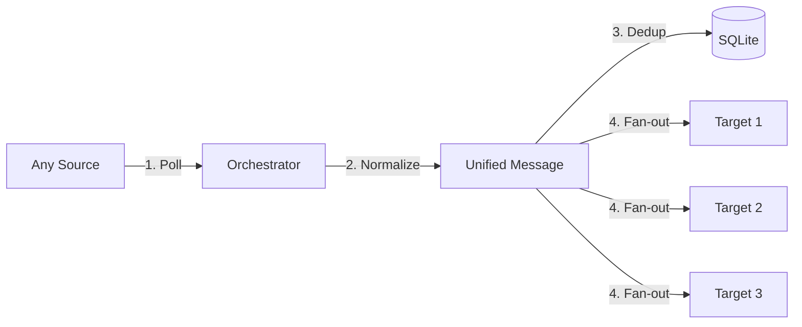

# 🤖 Universal Robot Sender

[**English**](./README.md) | [**فارسی**](./README.fa.md)

---

## 🏗️ Universal Workflow

---

## 🚀 Overview
A flexible Python-based message synchronization tool. Unlike standard bots, this system allows you to pick **any** supported platform as the source and forward its content to **any number** of target platforms simultaneously.

## ✨ Key Features
- **🔄 Universal Source/Target:** Soroush ↔ Telegram ↔ Bale ↔ Rubika ↔ Eitaa.
- **⚡ Async IO:** Powered by `asyncio` for high-performance concurrent delivery.
- **📦 Zero-Config DB:** Uses SQLite for local message tracking and deduplication.
- **🛠️ Fully Automated Setup:** No need to edit code or JSON files manually.
- **🐳 Docker Ready:** Minimal footprint, easy deployment.

---

## 🚀 Quick Setup (One-Click)

### 🔹 Windows
1. Right-click on **`setup.ps1`** and select **"Run with PowerShell"**.
2. Follow the interactive prompts to enter your tokens and channel IDs.
3. Choose `y` when asked to launch with Docker.

### 🔹 Manual (Linux/Docker)
1. Edit `config.json` with your credentials.
2. Run: `docker-compose up -d --build`

---

## 🛠️ Troubleshooting (T-Shoot)

| Issue | Cause | Solution |
| :--- | :--- | :--- |
| **`setup.ps1` cannot be loaded** | PowerShell execution policy | Run `Set-ExecutionPolicy -ExecutionPolicy RemoteSigned -Scope CurrentUser` in PowerShell. |
| **Docker command not found** | Docker is not installed | Install [Docker Desktop](https://www.docker.com/products/docker-desktop/) for Windows. |
| **Messages not syncing** | Invalid Tokens or IDs | Check `docker-compose logs -f app`. Ensure tokens are correct and the bot is admin in the channel. |
| **Database error** | Permission issues | Ensure the `data/` folder has write permissions. |
| **Source not fetching** | Platform API Rate limit | Increase the `interval` in `config.json` (e.g., to 120 seconds). |

---

## 📝 Iranian Messenger Setup
- **Eitaa:** Use [Eitaayar](https://eitaayar.ir) tokens. Add `@sender` as admin.
- **Soroush:** Use `@mrbot` tokens.
- **Bale/Rubika:** Use `@BotFather` tokens.

---

## 📜 License
MIT License.
