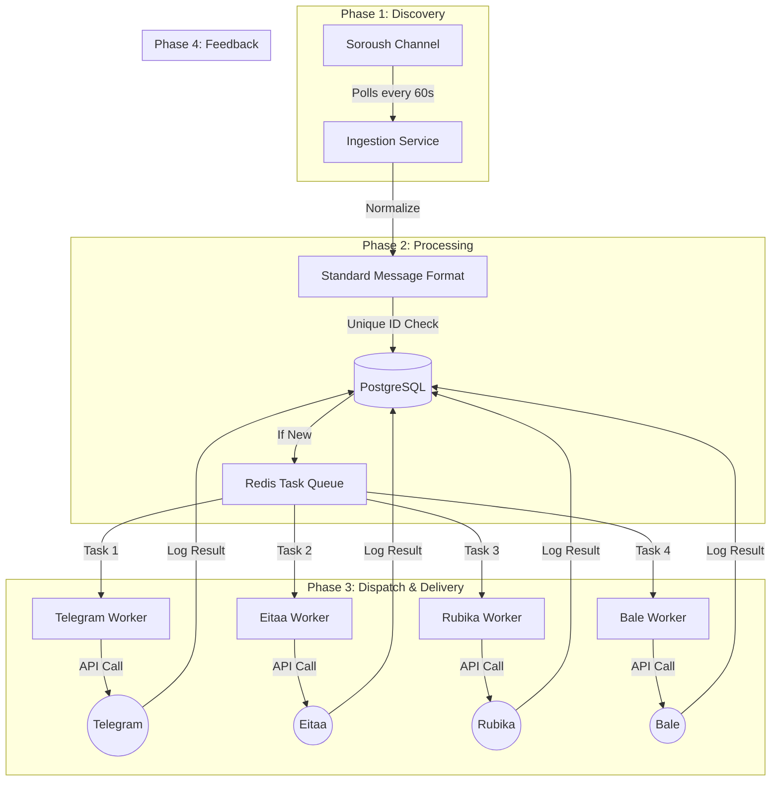

# 🤖 Robot Sender (Multi-Messenger Syncer)

[**English**](./README.md) | [**فارسی**](./README.fa.md)

---

## 🏗️ System Architecture & Workflow

### 1. Visual Flowchart


---

### 2. How it works (Step-by-Step)

1.  **Polling (Detection):** Every minute, the "Ingestion Service" asks the Soroush Plus API: "Are there any new posts?".
2.  **Normalization:** When a new post arrives (e.g., an Image with a caption), the system converts it into a **Universal Format**. It doesn't matter if it came from Soroush; it's now just a "Standard Image Task".
3.  **Deduplication:** The system checks the **PostgreSQL** database. If the Message ID `XYZ` was already synced before, it stops here to prevent spamming your channels.
4.  **Task Queuing:** If it's a new message, the system creates 4 separate instructions (Tasks) and puts them into **Redis**. 
5.  **Parallel Execution:** 4 independent "Workers" (one for each messenger) wake up. They work **at the same time**. 
    - If Telegram is slow, Eitaa doesn't wait. It finishes its job immediately.
    - If Rubika's API is down, its worker will keep retrying every few minutes without affecting Bale or Telegram.
6.  **Reporting:** Once a message is successfully sent (or permanently fails), the result is written back to the database so you can monitor it via the `/logs` endpoint.

---

## ✨ Features
- **🔄 Multi-Platform Sync:** Supports Text, Photos, Videos, and Files.
- **🛡️ Distributed Workers:** Each platform is handled by an independent process.
- **🔄 Exponential Backoff:** Automatic retries for failed tasks (1m, 2m, 4m...).
- **🚫 Anti-Duplicate:** PostgreSQL ensures no double-posting.
- **🐳 One-Click Deploy:** Fully containerized with Docker Compose.

---

## 🚀 Quick Setup

1. **Clone & Configure:**
   ```bash
   cp .env.example .env
   # Edit .env with your tokens
   ```

2. **Deploy:**
   ```bash
   docker-compose up -d --build
   ```

3. **Monitor:**
   - Health: `http://localhost:8000/health`
   - Logs: `docker-compose logs -f worker`

---

## 📝 Iranian Messenger Tips
- **Eitaa:** Get token from [Eitaayar](https://eitaayar.ir) and add `@sender` as admin.
- **Soroush:** Use `@mrbot` in Soroush Plus for tokens.
- **Bale/Rubika:** Use `@BotFather` within the apps.

---

## 📜 License
MIT License.
