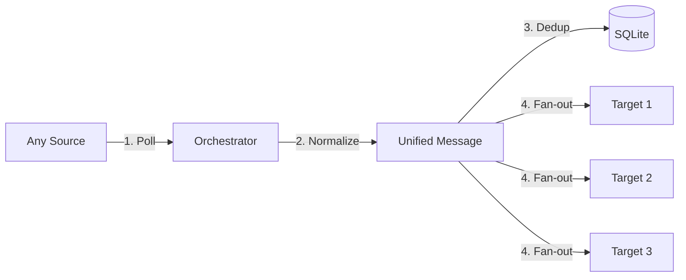

# 🤖 Universal Robot Sender

[**English**](./README.md) | [**فارسی**](./README.fa.md)

---

## 🏗️ Universal Workflow



---

## 🚀 Overview
A flexible Python-based message synchronization tool. Unlike standard bots, this system allows you to pick **any** supported platform as the source and forward its content to **any number** of target platforms simultaneously.

## ✨ Key Features
- **🔄 Universal Source/Target:** Soroush ↔ Telegram ↔ Bale ↔ Rubika ↔ Eitaa.
- **⚡ Async IO:** Powered by `asyncio` for high-performance concurrent delivery.
- **📦 Zero-Config DB:** Uses SQLite for local message tracking and deduplication.
- **🛠️ Fully Configurable:** Everything is managed via a single `config.json` file.
- **🐳 Docker Ready:** Minimal footprint, easy deployment.

---

## 🚀 Quick Setup

1. **Configure:**
   Edit `config.json` to define your source, targets, and credentials.
   ```json
   {
     "source": "soroush",
     "source_channel_id": "...",
     "targets": {
       "telegram": "@my_channel",
       "bale": "..."
     },
     "credentials": { ... }
   }
   ```

2. **Deploy:**
   ```bash
   docker-compose up -d --build
   ```

---

## 📝 Iranian Messenger Setup
- **Eitaa:** Use [Eitaayar](https://eitaayar.ir) tokens.
- **Soroush:** Use `@mrbot` tokens.
- **Bale/Rubika:** Use `@BotFather` tokens.

---

## 📜 License
MIT License.
