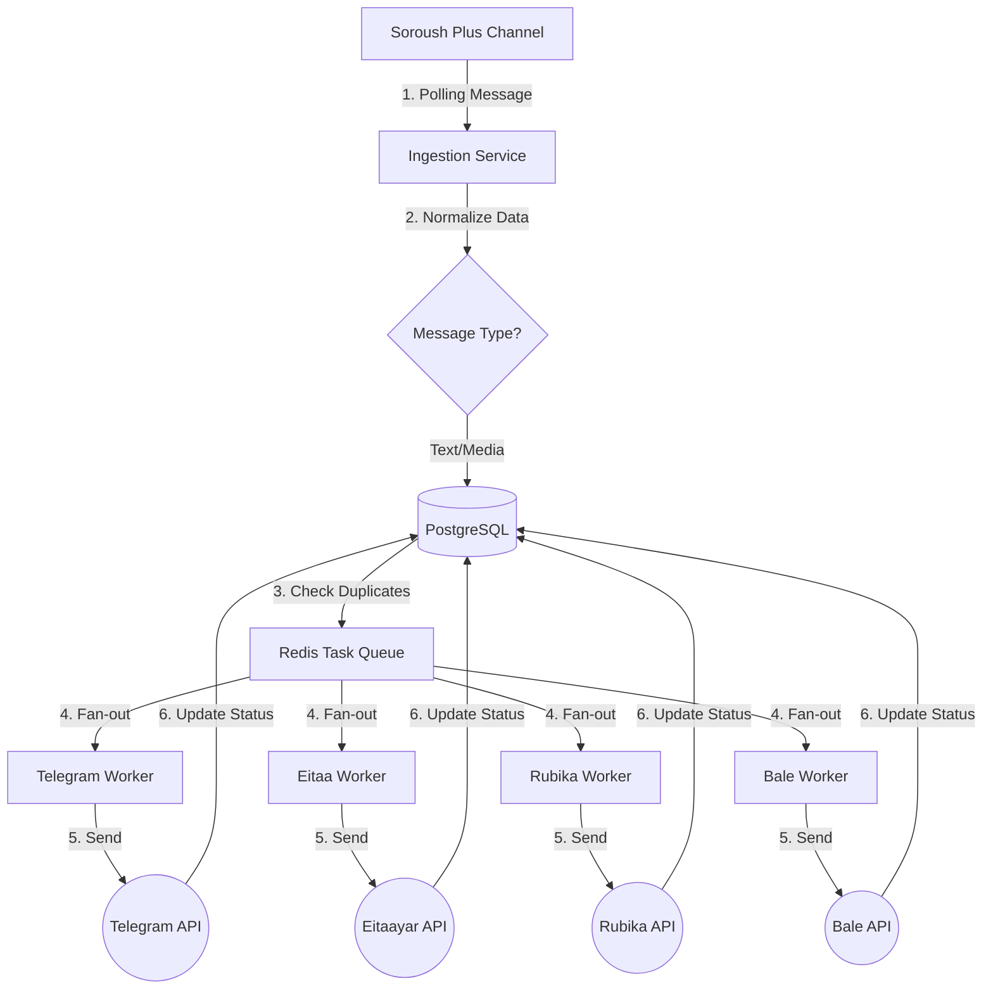

# 🤖 Robot Sender (Multi-Messenger Syncer)

[**English**](./README.md) | [**فارسی**](./README.fa.md)

---

## 🏗️ System Workflow (Graphical Overview)



---

## 🚀 Overview
An enterprise-grade synchronization bot that mirrors content from a **Soroush Plus** channel to **Telegram, Eitaa, Rubika, and Bale** in real-time. Built with a distributed architecture to ensure 99.9% delivery success even during API outages.

## ✨ Features
- **🔄 Multi-Platform Sync:** Supports Text, Photos, Videos, and Files.
- **🛡️ Distributed Workers:** Each platform is handled by an independent process.
- **🔄 Exponential Backoff:** Automatic retries for failed tasks (1m, 2m, 4m...).
- **🚫 Anti-Duplicate:** PostgreSQL ensures no double-posting.
- **🐳 One-Click Deploy:** Fully containerized with Docker Compose.

---

## 🚀 Quick Setup

1. **Clone & Configure:**
   ```bash
   cp .env.example .env
   # Edit .env with your tokens
   ```

2. **Deploy:**
   ```bash
   docker-compose up -d --build
   ```

3. **Monitor:**
   - Health: `http://localhost:8000/health`
   - Logs: `docker-compose logs -f worker`

---

## 📝 Iranian Messenger Tips
- **Eitaa:** Get token from [Eitaayar](https://eitaayar.ir) and add `@sender` as admin.
- **Soroush:** Use `@mrbot` in Soroush Plus for tokens.
- **Bale/Rubika:** Use `@BotFather` within the apps.

---

## 📜 License
MIT License.
